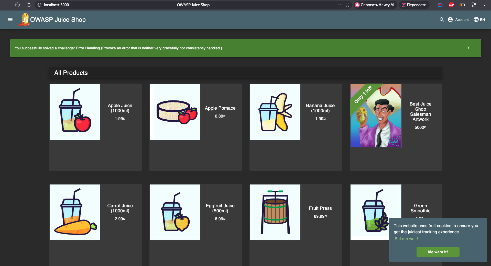

# Triage Report — OWASP Juice Shop

## Scope & Asset
- Asset: OWASP Juice Shop (local lab instance)
- Image: bkimminich/juice-shop:v19.0.0
- Release link/date: https://github.com/juice-shop/juice-shop/releases/tag/v19.0.0 — Sep 4, 2025
- Image digest (optional): 2cc4c6e7b51539b864cda04080bc1a869e3dd86c11a4dce4b3b5095b059765ec

## Environment
- Host OS: macOS 26.2
- Docker: 28.0.4

## Deployment Details
- Run command used: 

```bash
docker run -d --name juice-shop \
  -p 127.0.0.1:3000:3000 \
  bkimminich/juice-shop:v19.0.0
```
- Access URL: http://127.0.0.1:3000
- Network exposure: 127.0.0.1 only  
  [x] Yes  [ ] No  

## Health Check
- Page load:  


- API check:
```bash
curl -s http://127.0.0.1:3000/api/Products | head
{
  "status": "success",
  "data": [{
    "id": 1,
    "name": "Apple Juice (1000ml)",
    ...,
    }]
  }
```

Note: The `/rest/products` path returns an error page. The backend REST API is exposed under `/api/products`, which returns the expected JSON response.


## Surface Snapshot (Triage)

* #### Login/Registration visible: [*] Yes
  User login and registration forms are publicly accessible.
* #### Product listing/search present: [*] Yes
  Product catalog and search functionality are available without authentication.
* #### Admin or account area discoverable: [*] Yes
  Account-related routes and potential admin functionality are hinted via client-side routing.
* #### Client-side errors in console: [*] Yes
  Browser displays a security warning about potential Self-XSS risks when using the developer console. No application runtime errors observed.

* #### Security headers (quick look):
  `curl -I http://127.0.0.1:3000` 
    - X-Content-Type-Options and X-Frame-Options present (good)
    - CSP not observed
    - HSTS not observed 
    - Access-Control-Allow-Origin: * (permissive)


## Risks Observed (Top 3)

1. Broken Access Control — Juice Shop is intentionally vulnerable and may expose privileged functionality through IDOR or forced browsing.
2. Injection Vulnerabilities — User input fields such as search and login are likely susceptible to SQL injection or XSS.
3. Sensitive Information Exposure — Detailed unauthenticated API responses and client-side routing information may leak internal application structure.

## PR Template Setup Verification
- `.github/pull_request_template.md` was created on main branch.
- PR description auto-fills with sections Goal / Changes / Testing / Artifacts & Screenshots.
- Template ensures consistency across lab submissions.


## GitHub Community

During the lab, I:

* Starred the course repository and simple-container-com/api repository
* Followed professor (@Cre-eD), TAs (@marat-biriushev, @pierrepicaud), and three classmates

**Why this matters:**

* **Stars**: help track popular projects, discover useful tools, and support open-source maintainers.
* **Following developers**: improves networking, allows learning from others’ code, and helps stay updated with new projects.

